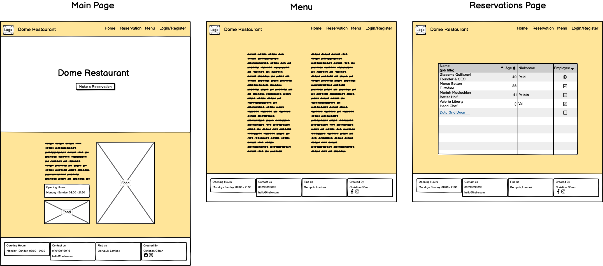
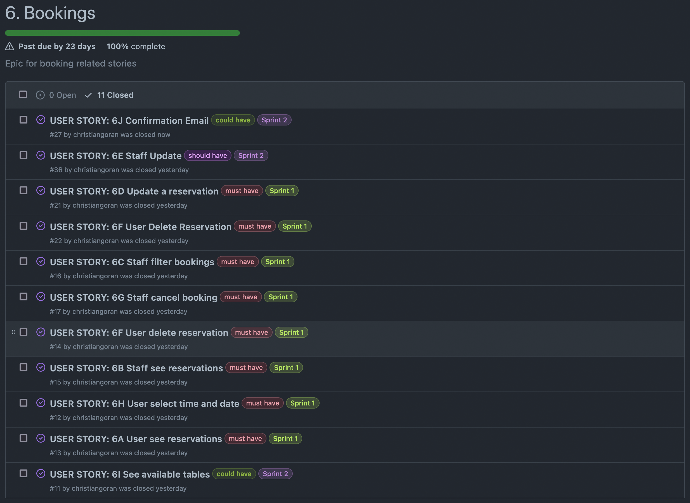

# Dome Restaurant 

 

## Table of contents
  * [Overview](#overview)
  * [UX](#ux)
    + [Strategy](#strategy)
    + [Scope](#scope-hr-)
    + [Structure](#structure-hr-)
    + [Skeleton](#skeleton-hr-)
    + [Surface](#surface-hr-)
      - [Color Scheme & Fonts](#color-scheme-and-fonts)
      - [Visual Effects](#visual-effects)
  * [Agile Methodology](#agile-methodology)
  * [Features](#features)
    + [Existing Features](#existing-features)
      - [Create bookings](#create-bookings)
      - [Menu](#menu)
      - [Profiles](#profiles)
      - [Staff bookings management](#staff-bookings-management)
    + [Future Feature Considerations](#future-feature-considerations)
  * [Responsive Layout and Design](#responsive-layout-and-design)
  * [Tools Used](#tools-used)
    + [Python packages](#python-packages)
  * [Testing](#testing)
  * [Deployment](#deployment)
    + [Deploy on heroku](#deploy-on-heroku)
    + [FORK THE REPOSITORY](#fork-the-repository)
    + [CLONE THE REPOSITORY](#clone-the-repository)
  * [Credits](#credits)
    + [Content](#content)
    + [Media](#media)
    + [Code](#code)
  * [Acknowledgements](#acknowledgements)

## Overview
This project serves as a comprehensive booking and management platform for the Dome Restaurant. The platform allows customers to easily reserve tables, add special notes for their bookings, and specify the number of guests. On the other side, staff members can manage these bookings efficiently through a staff-only interface. The system ensures that only available tables are offered to the customers, considering variables like time, date, and capacity. The platform is designed to handle real-world scenarios with ease. The application was built using Python (Django), HTML, CSS, and JavaScript, with data being stored in a PostgreSQL database and images on a Cloudinary account.

  
The deployed project can be accessed at [this link](https://dome-restaurant-hero-9071346b8ec2.herokuapp.com/).
  

## UX
This site was created according to the Five Planes Of Website Design: 
### Strategy

**User Stories:**  

|   EPIC                                |ID|                                User Story                                                   |
| :-------------------------------------|--|:------------------------------------------------------------------------------------------- |
|**Base Setup**                         |  ||
|                                       |1A| As a developer, I need to create the base.html page and structure so that other pages can reuse the layout|             
|                                       |1B| As a developer, I need to create static resources so that images, css and javascript work on the website|
|                                       |1C| As a site user I can see a navigation menu so that I can easily navigate through the site|
|                                       |1D| As a site user I can have a good UX/UI experience when browsing the site so that I am encouraged to stay on the website and eventually also visit the restaurant|
|                                       |1E| As a developer, I need to set up the project so that it is ready for implementing the necessary features|
|                                       |1F| As a developer, I need to create the footer for social media links and contact information|
|**Stand Alone Pages**                  |  ||
|                                       |2A| As a developer, I need to implement a 404 error page to alert users when they have accessed a page that doesn't exist|
|                                       |2B| As a developer, I need to implement a 500 error page to alert users when an internal server error occurs|
|                                       |2C| As a developer, I need to implement a 403 error page to redirect unauthorised users to so that I can secure my views|
|                                       |2D| As a restaurant owner, I would like a home page so that customers can view information on my restaurant|
|**Authentication**                     |  ||
|                                       |3A| As a site user I can create an account so that I can create reservations in my name|
|                                       |3B| As a site user I can use my email and password to login so that my account is secure|
|                                       |3C| As a site user I can logout from my account so that I keep my account secure|
|                                       |3D| As a site user I can reset my password by sending a link so that I can login even if I forgot my password|
|**Contact**                            |  ||
|                                       |4A| As a user, I want to see the restaurant's opening and closing hours|
|                                       |4B| As a user, I want to see location information on the website|
|                                       |4C| As a user, I want to see contact information on the website|
|                                       |4D| As a user, I want to see relevant information on the website|
|**Menu**                               |  ||
|                                       |5A| As a user, I want to see the restaurant's menu with details about ingredients and price, so that I can be completely aware of everything I want to order|
|                                       |5B| As a staff member I can update menu items so that I have an easier time managing dish items|
|**Bookings**                           |  ||
|                                       |6A| As a logged in user I can se a list of my reservations so that I can have a better overview|
|                                       |6B| As a logged-in staff member I can see upcoming reservations so that we can prepare the working day|
|                                       |6C| As a logged-in staff member I can filter  reservations so that I can see reservations for a specific date|
|                                       |6D| As a logged-in user I can update a selected reservation so that choose a more convenient time|
|                                       |6E| As a logged-in staff member I can update a selected reservation to help clients|X
|                                       |6F| As a logged-in user I can delete reservations so that I have control over my bookings|
|                                       |6G| As a logged-in staff member I can cancel bookings so that I can help a client with the cancellation|
|                                       |6H| As a logged-in user I can select a time and date so that to finalize my reservation|
|                                       |6I| As a logged-in user I can see available tables for a specific date and time so that I can easier devide where to sit|
|                                       |6J| As a site user I get confirmation email when making a reservation so that the risk of becoming a no-show-reservation is minimized|
|**Deployment**                         |  ||
|                                       |7A| As a developer, I need to remove comments, turn of DEBUG so that my project is ready for final deployment|
|                                       |7B| As a developer, I need to deploy the project to heroku so that it is live for customers|
|**Documentation**                      |  ||
|                                       |8A| As a developer I need to write automated tests  and testing documentation so that others and myself can better understand my project|
|                                       |8B| As a developer I need to write readme.md so that others and myself can better understand my project|

**Project Goal:** 
The goal for the project is to create a website with good UX/UI in mind that is usefull to staff members and clients. The website should convey an emotional response in the user.

**Project Objectives:** 
* To create a simple and intuitive website that with the help of UX conveys an positive emotional response in the user;
* The design and content should help instill a better image of the client and their business;
* To make to clear categories of login accounts for staff members and clients;
* To implement features and design that upgrade the users experience;
* To make a responsive website that works on every device.  

### Scope

**Simple and Intuitive UX** 
* Create a website that follows the graphical profile and theme of the client;
* Create a header and a footer;
* Create a navbar that is visible throughout the website;
* Ensure that all user changes are notified to the user visually;
* Ensure that the user keeps their orientation during their navigation througout the website.

**Relevant Content** 
* Add relevant information about the restaurant, including its name, location, phone number and email;
* Create a clear and attrative presentation of the restaurant menu;
* Add photos that depict some of the food offered at the restaurant.

**Features for Upgraded Experience** 
* Create a reservation section that allows the users to see all the reservations  available for a specific date and time:
* Create a Menu feature that displays all the menu information;
* Create a Profile page for the user to see his upcoming bookings and favourite meals;
* Create a staff-member account to manage all the bookings for all the users;

**Clints % Staff Members Different Accounts** 
* Allow access to Profile page only for client type of users;
* Allow access to Manage Bookings page only for staff members type of users;
* Create a filter function only visible for staff-members for them to find specific reservations.

**Responsiveness** 
* Create a responsive website that works on every device and screen size.  

### Structure

The website is designed with a focus on user experience and is divided into 6 distinct pages, each serving a specific purpose. The content displayed on these pages varies based on whether the user is authenticated and whether they are a client or staff member. Here are the details:

* **Register/Login:** These pages allow users to create an account or authenticate into an existing one, providing access to various exclusive features.
* **Logout:** This is implemented as a modal dialog that allows users to securely log out of their accounts.
* **Home:** Accessible to all users, this page showcases the restaurant's ambiance, popular dishes, opening & closing times and contact info.
* **Menu:** This page displays the restaurant's menu items. An "Add to Favourite" feature is available only to logged-in clients.
* **Reservations/profile:** Exclusive to authenticated users, this page enables both clients and staff members to make or manage bookings.
* **Staff Manage Bookings:** Accessible only to staff members, this page displays all registered bookings, which can be grouped and filtered by date.

#### Flowchart
The project flowchart was created using <b>LucidChart</b>.  
  

### Skeleton

**Wireframes** 
The wireframes for mobile and desktop were created with [Balsamiq](https://balsamiq.com/) tool and can be viewed 

Here:

 

 

**Database** 
The project uses ElephantSQL as PostgreSQL relational database for storing the data. 
Two diagrams were created to represent the relationships between the tables. The first diagram was created before the website was developed, and it was used to identify the most relevant and useful attributes and tables. The final diagram was created after the website was developed, and it reflects the changes that were made to the attributes and tables.

  
Initial Model

 

  
Final Model

 

 

### Surface

#### Color Scheme and Fonts
* The fonts I used for this site were imported from [Google Fonts](https://fonts.google.com/): 
* h1 - h6 elements: *Lato*
* paragraphs, links: *Baskerville*

 

#### Visual Effects

* **Hover effects** 

  
NavBar element hover and active effect

 

 

## Agile Methodology
This project was developed using the Agile methodology. 
All epics and user stories implementation progress was registered using [GitHub](https://github.com/). As the user stories were accomplished, they were moved in the GitHub Kanban board from **ToDo**, to **In Progress**, **Done** and **Not Implemented** lists. 

Sprint Details

* **KANBAN BOARD**  
      
* **EPIC 1 - BASE SETUP** 
    -1A Create base.html 
    -1B Create static resources 
    -1C Create navigation menu 
    -1D Design according to good UX practices 
    -1E Setup Django project 
    -1F Create a footer  
      
* **EPIC 2 - STAND ALONE PAGES** 
    -2A Implement 404 page 
    -2B Implement 505 page 
    -2C Implement 403 page 
    -2D Create a restaurant page  
      
* **EPIC 3 - AUTENTHICATION** 
    -3A Implement the *Register* page using the django-allauth module 
    -3B Implement the *Login* page using django-allauth module 
    -3C Implement *Logout* modal using django-allauth module 
    -3D Implement a *Reset password* function  
      
* **Sprint 4 - CONTACT** 
    -4A Implement opening & closing times on the webpage 
    -4B Implement information about location of the restaurant 
    -4C Implement contact information 
    -4D Implement other relevant information  
      
* **Sprint 5 - MENU** 
    -5A Create a menu page with menu items 
    -5B Implement a function so that staff can enter new items on the menu  
      
* **Sprint 6 - BOOKINGS** 
    -6A Implement reservation view for site user 
    -6B Implement reservation view for staff 
    -6C Implement reservation filter function for staff 
    -6D Implement function so site user can update a reservation 
    -6E Implement function so staff can update reservation 
    -6F Implement so user can delete a reservation 
    -6G Implement so staff can delete reservations 
    -6H Implement function so that user can create a reservation 
    -6I Implement so that site user can see available tables 
    -6J Implement so that user receives a confirmation email after creating a reservation  
      
* **Sprint 7 - DEPLOYMENT** 
    -7A Prepare the project for deployment 
    -7B Deploy the project to Heroku  
      
* **Sprint 8 - DOCUMENTATION** 
    -8A Create automated tests 
    -8B Write documentation for project in README.md  
      

  

## Features

### Existing Features

#### Create bookings

Every user that is authenticated can access the *Reservation* page for making a reservation. This feature provides a form where the user can fill in the reservation details.
* The form is for selecting the date and time interval of the booking.
    The inputs are validated after the following rules:
    * The Date value should not be less than the current day; 
    * Entering Name, date and number of people is required; 
    * Maximum number of guests for a reservation is 8 people; 
    * The used can choose times from a list;
      * 1: 12:00 - 12:45
      * 2: 14:00 - 15:45
      * 3: 16:00 - 17:45
      * 4: 18:00 - 19:45
      * 5: 20:00 - 21:45  

   
  

* If the reservation is submitted successfully, a success message will appear   

#### Menu

#### Profiles

#### Staff bookings management

### Future Feature Considerations

## Responsive Layout and Design

## Tools Used

### Python packages

* Django (Framework)
* django-allauth (Library)
* django-bootstrap-datepicker-plus (Library)
* django-crispy-forms (Library)
* cloudinary (Library)
* gunicorn (Web Server)
* psycopg2 (Library)

## Testing
The testing documentation can be found at [TESTING.md](TESTING.md)

## Deployment

### Deploy on Heroku
 1. Create Pipfile 
 
 In the terminal enter the command ` pip3 freeze > requirements.txt`, and a file with all requirements will be created. 
 
 2. Setting up Heroku

    * Go to the Heroku website (https://www.heroku.com/) 
    * Login to Heroku and choose *Create App* 
    * Click *New* and *Create a new app*
    * Choose a name and select your location
    * Go to the *Resources* tab 
    * From the Resources list select *Heroku Postgres*
    * Navigate to the *Deploy* tab
    * Click on *Connect to Github* and search for your repository
    * Navigate to the *Settings* tab
    * Reveal Config Vars and add your Cloudinary, Database URL (from Heroku-Postgres) and Secret key.    

3. Deployment on Heroku

    * Go to the Deploy tab.
    * Choose the main branch for deploying and enable automatic deployment 
    * Select manual deploy for building the App 
    
### Fork the repository
For creating a copy of the repository on your account and change it without affecting the original project, use<b>Fork</b> directly from GitHub:
- On [My Repository Page](https://github.com/christiangoran/dome-restaurant-repo), press <i>Fork</i> in the top right of the page
- A forked version of my project will appear in your repository  

### Clone the repository
For creating a clone of the repository on your local machine, use<b>Clone</b>:
- On [My Repository Page](https://github.com/christiangoran/dome-restaurant-repo), click the <i>Code</i> green button, right above the code window
- Chose from <i>HTTPS, SSH and GitClub CLI</i> format and copy (preferably <i>HTTPS</i>)
- In your <i>IDE</i> open <i>Git Bash</i>
- Enter the command <code>git clone</code> followed by the copied URL
- Your clone was created

## Credits

### Content

### Media

### Code

## Acknowledgements
