# Dome Restaurant Website Testing Documentation

## Summary

This document outlines the testing procedures and acceptance criteria for the Restaurant Reservation System project. It includes manual testing steps, expected outcomes, and references to automated tests where applicable.

## Table of Contents
1. [Base Setup](#base-setup)
2. [Stand Alone Pages](#stand-alone-pages)
3. [Authentication](#authentication)
4. [Contact](#contact)
5. [Menu](#menu)
6. [Bookings](#bookings)
7. [Deployment](#deployment)
8. [Documentation](#documentation)

---

## 1. Base Setup 

### User Story 1A: Create base.html Page

**Manual Steps:**

1. Open the website.
2. Navigate through different pages and observe the layout.

**Acceptance Criteria:**

- The base layout should be consistent across different pages.

**Automated Tests:**

- None

**Outcome:**

- Pass

---

### User Story 1B: Create Static Resources

**Manual Steps:**

1. Open the website.
2. Check if images, CSS, and JavaScript are loading correctly.

**Acceptance Criteria:**

- All static resources must load without errors.

**Automated Tests:**

- None

**Outcome:**

- Pass

---

### User Story 1C: Navigation Menu

**Manual Steps:**

1. Open the website.
2. Check if a navigation menu is visible on all pages.

**Acceptance Criteria:**

- The navigation menu must be functional and present on all pages.

**Automated Tests:**

- None

**Outcome:**

- Pass

## 2. Stand Alone Pages 

### User Story 2A: Implement 404 Error Page

**Manual Steps:**

1. Open the website.
2. Navigate to a non-existent URL.

**Acceptance Criteria:**

- A custom 404 error page should be displayed.

**Automated Tests:**

- None

**Outcome:**

- FAIL so far

---

### User Story 2B: Implement 500 Error Page

**Manual Steps:**

1. Open the website.
2. Simulate a server error.

**Acceptance Criteria:**

- A custom 500 error page should be displayed during server errors.

**Automated Tests:**

- None

**Outcome:**

- FAIL so far

---

### User Story 2C: Implement 403 Error Page

**Manual Steps:**

1. Open the website.
2. Try to access a restricted page without appropriate permissions.

**Acceptance Criteria:**

- A custom 403 error page should be displayed.

**Automated Tests:**

- None

**Outcome:**

- FAIL so far

---

### User Story 2D: Implement Home Page

**Manual Steps:**

1. Open the website.
2. Check if the home page is accessible and displays restaurant information.

**Acceptance Criteria:**

- Home page should be functional and display relevant information.

**Automated Tests:**

- `test_home_view`

**Outcome:**

- Pass

## 3. Authentication 

### User Story 3A: User Account Creation

**Manual Steps:**

1. Open the website and go to the 'Sign Up' page.
2. Fill out the required fields and submit.

**Acceptance Criteria:**

- User should be able to successfully create an account.

**Automated Tests:**

- None

**Outcome:**

- Pass

---

### User Story 3B: User Login

**Manual Steps:**

1. Open the website and go to the 'Login' page.
2. Enter the email and password.

**Acceptance Criteria:**

- User should be able to login successfully.

**Automated Tests:**

- None

**Outcome:**

- Pass

---

### User Story 3C: User Logout

**Manual Steps:**

1. Log in to the website.
2. Click the 'Logout' button.

**Acceptance Criteria:**

- User should be logged out successfully.

**Automated Tests:**

- None

**Outcome:**

- Pass

---

### User Story 3D: Password Reset

**Manual Steps:**

1. Go to the 'Login' page and click 'Forgot Password'.
2. Enter the email address and submit.

**Acceptance Criteria:**

- A password reset link should be sent to the email.

**Automated Tests:**

- None

**Outcome:**

- FAIL (Function not implemented at this stage)

## 4. Contact 

### User Story 4A: View Opening and Closing Hours

**Manual Steps:**

1. Open the website and navigate to the 'Information' page.
2. Locate the opening and closing hours section.

**Acceptance Criteria:**

- User should be able to view the restaurant's opening and closing hours.

**Automated Tests:**

- None

**Outcome:**

- Pass

---

### User Story 4B: View Location Information

**Manual Steps:**

1. Open the website and navigate to the 'Information' page.
2. Locate the restaurant's address section.

**Acceptance Criteria:**

- User should be able to see the restaurant's location information.

**Automated Tests:**

- None

**Outcome:**

- Pass

---

### User Story 4C: View Contact Information

**Manual Steps:**

1. Open the website and navigate to the 'Information' page.
2. Locate the contact information section.

**Acceptance Criteria:**

- User should be able to see the contact information like phone number and email.

**Automated Tests:**

- None

**Outcome:**

- Pass

---

### User Story 4D: View Relevant Information

**Manual Steps:**

1. Open the website and navigate to the 'Information' page.
2. Browse through the content.

**Acceptance Criteria:**

- User should be able to find relevant information.

**Automated Tests:**

- None

**Outcome:**

- Pass

## 5. Menu 

### User Story 5A: View Restaurant's Menu

**Manual Steps:**

1. Open the website and navigate to the 'Menu' page.
2. Browse through the available menu items, their ingredients, and prices.

**Acceptance Criteria:**

- User should be able to view a list of dishes along with their ingredients and prices.

**Automated Tests:**

- `test_menu_view`

**Outcome:**

- Pass

--

### User Story 5B: Update Menu Items

**Manual Steps:**

1. Log in as a staff member.
2. Navigate to the admin panel and select the 'Menu' option.
3. Update an existing menu item or add a new one.

**Acceptance Criteria:**

- Staff member should be able to update menu items successfully.

**Automated Tests:**

- None

**Outcome:**

- FAIL, the function was never implemented.

---

## 6. Bookings 

### User Story 6A: View List of Reservations

**Manual Steps:**

1. Log in as a user.
2. Navigate to the 'Reservations' section.
3. Check the displayed list of reservations.

**Acceptance Criteria:**

- User should be able to see a list of all their reservations.

**Automated Tests:**

- `test_index_reservation_view`

**Outcome:**

- Pass

---

### User Story 6B: Staff View of Upcoming Reservations

**Manual Steps:**

1. Log in as a staff member.
2. Navigate to the admin panel and view 'Reservations'.

**Acceptance Criteria:**

- Staff should see a list of all upcoming reservations.

**Automated Tests:**

- `test_if_user_is_staff_return_all_reservations`

**Outcome:**

- Pass

---

### User Story 6C: Filter Reservations by Date

**Manual Steps:**

1. Log in as a staff member.
2. Use the date filter in the 'Reservations' section.

**Acceptance Criteria:**

- Staff should be able to filter reservations by date.

**Automated Tests:**

- `test_search_by_date`

**Outcome:**

- Pass

---

### User Story 6D: Update a Selected Reservation

**Manual Steps:**

1. Log in as a user.
2. Go to 'Reservations'.
3. Select a reservation to edit.

**Acceptance Criteria:**

- User should be able to edit the selected reservation details.

**Automated Tests:**

- `test_update_reservation_view`
- `test_update_reservation`

**Outcome:**

- Pass

---

### User Story 6E: Staff Updates Reservation

**Manual Steps:**

1. Log in as a staff member.
2. Navigate to the 'Reservations'.
3. Select a reservation and edit it.

**Acceptance Criteria:**

- Staff should be able to edit any reservation.

**Automated Tests:**

- None

**Outcome:**

- Pass

---

### User Story 6F: Delete a Reservation

**Manual Steps:**

1. Log in as a user.
2. Navigate to 'Reservations'.
3. Select a reservation to delete and confirm deletion.

**Acceptance Criteria:**

- User should be able to delete their reservations.

**Automated Tests:**

- `test_delete_reservation_view`
- `test_authorized_user_delete_reservation`

**Outcome:**

- Pass

---

### User Story 6G: Staff Cancels Booking

**Manual Steps:**

1. Log in as a staff member.
2. Go to 'Reservations'.
3. Select a reservation to cancel and confirm cancellation.

**Acceptance Criteria:**

- Staff should be able to cancel any reservations.

**Automated Tests:**

- None

**Outcome:**

- Pass

---

### User Story 6H: Select Time and Date for Reservation

**Manual Steps:**

1. Log in as a user.
2. Go to 'Create a Reservation'.
3. Select the desired time and date.

**Acceptance Criteria:**

- User should be able to select a time and date for their reservation.

**Automated Tests:**

- None

**Outcome:**

- Pass

---

### User Story 6I: View Available Tables

**Manual Steps:**

1. Log in as a user.
2. Go to 'Create a Reservation'.
3. Select time and date to see available tables.

**Acceptance Criteria:**

- User should be able to view available tables for the selected time and date.

**Automated Tests:**

- None

**Outcome:**

- FAIL, this function was never implemented.

---

### User Story 6J: Email Confirmation for Reservation

**Manual Steps:**

1. Log in as a user.
2. Make a reservation.
3. Check the email for confirmation.

**Acceptance Criteria:**

- User should receive an email confirmation after making a reservation.

**Automated Tests:**

- None

**Outcome:**

- FAIL, this function was not implemented yet.

---

### User Story 7A: Remove Debug and Comments for Deployment

**Manual Steps:**

1. Go to the project settings.
2. Turn off DEBUG mode.
3. Remove any unnecessary comments in the code.

**Acceptance Criteria:**

- DEBUG mode should be off.
- No unnecessary comments should be present in the codebase.

**Automated Tests:**

- (Assume manual testing, as no automated test mentioned)

**Outcome:**

- FAIL, not done yet

---

### User Story 7B: Deploy to Heroku

**Manual Steps:**

1. Commit all changes to the repository.
2. Push to Heroku remote.
3. Open Heroku link to confirm deployment.

**Acceptance Criteria:**

- Project should be accessible via Heroku URL.

**Automated Tests:**

- (Assume manual testing, as no automated test mentioned)

**Outcome:**

- Pass

---

### User Story 8A: Write Automated Tests and Testing Documentation

**Manual Steps:**

1. Write automated tests covering key functionalities.
2. Document these tests in `testing.md`.

**Acceptance Criteria:**

- Sufficient automated tests should be written and documented.

**Automated Tests:**

- None

**Outcome:**

- Pass

---

### User Story 8B: Write readme.md

**Manual Steps:**

1. Document the project setup, features, and functionalities in `readme.md`.

**Acceptance Criteria:**

- `readme.md` should be comprehensive and informative.

**Automated Tests:**

- None

**Outcome:**

- Pass

## Browser Testing
The website was tested on different browser for assuring the features work accordingly.
* Safari
* Chrome
* Firefox
* Edge
* Opera

## Code Validation
### HTML

The html code of the website was validated using [W3 Markup Validator](https://validator.w3.org/). 
At the time of deployment the validation have the following outcome:  

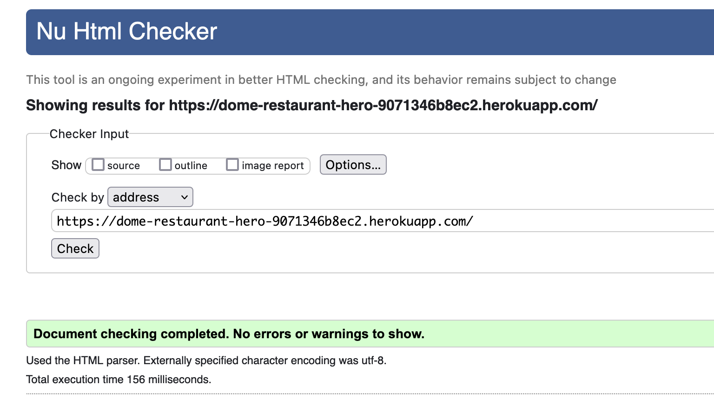  

The following pages have been tested:
* Home
* Menu
* Reservations
* Information
* Login/Register
* 403/404/500 custom pages

### CSS

The CSS code was validated using [W3 Jigsaw Validator](https://jigsaw.w3.org/css-validator/) 
At the time of deployment the validation for *style.css* has the following outcome:  

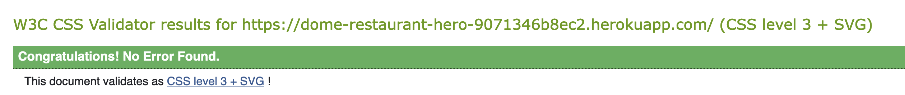  

### Javascript

My project only used one function without any argument in my project. It is a function that removes the user notification windows after three seconds and is written straight into the base.html file since I considered it unecessary with a separate js file for it.

    
    setTimeout(function () {
      $("#msg").alert("close");
    }, 3000);   

### Python
The python code was tested using [Coding Institutes Python Linter](https://pep8ci.herokuapp.com/). 

**Pep8 results:** 

Reservation app

* **apps.py** 

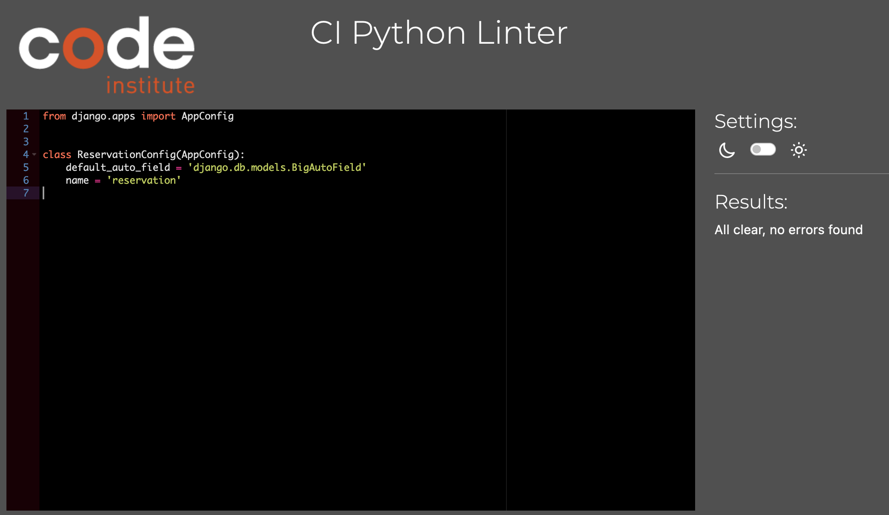  

* **urls.py** 

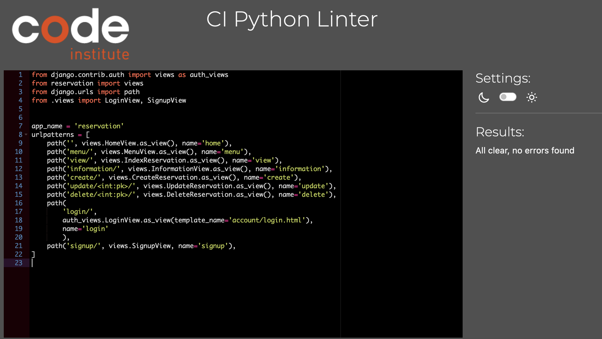  

* **views.py** 

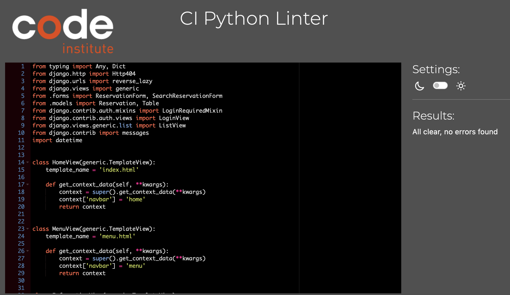  

* **forms.py** 

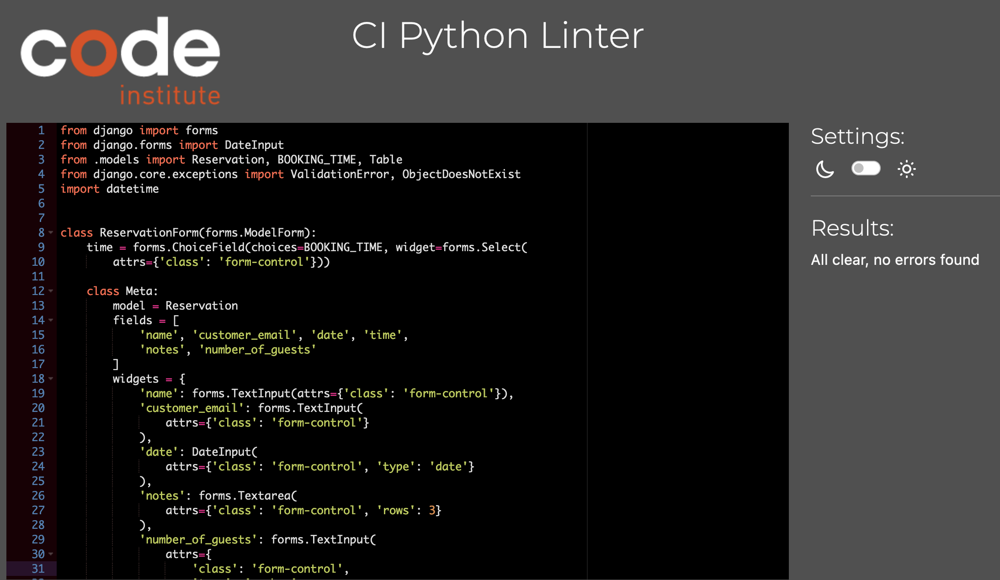  

* **models.py** 

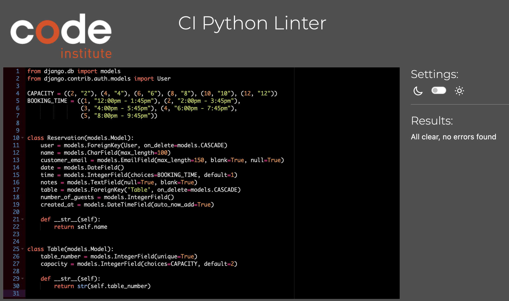  

* **test_forms.py** 

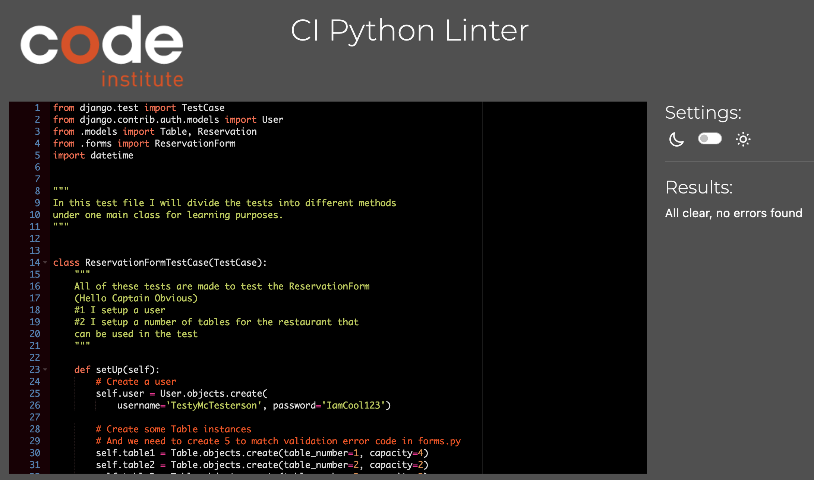  

* **test_views.py** 

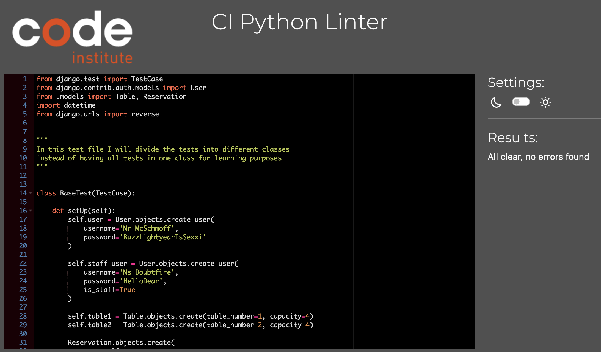  

### Accesibility 
The accesibility of the website was tested with [Wave](https://wave.webaim.org/)
Throughout the all pages there is an Alert due to a "Home" link in the navbar that is situated next to the company-logo that also works as a "home"-link. I decided to ignore this alert to make it easier for the user to find their way back to the starting page.

**Wave results:**

Home Page

  

Menu Page

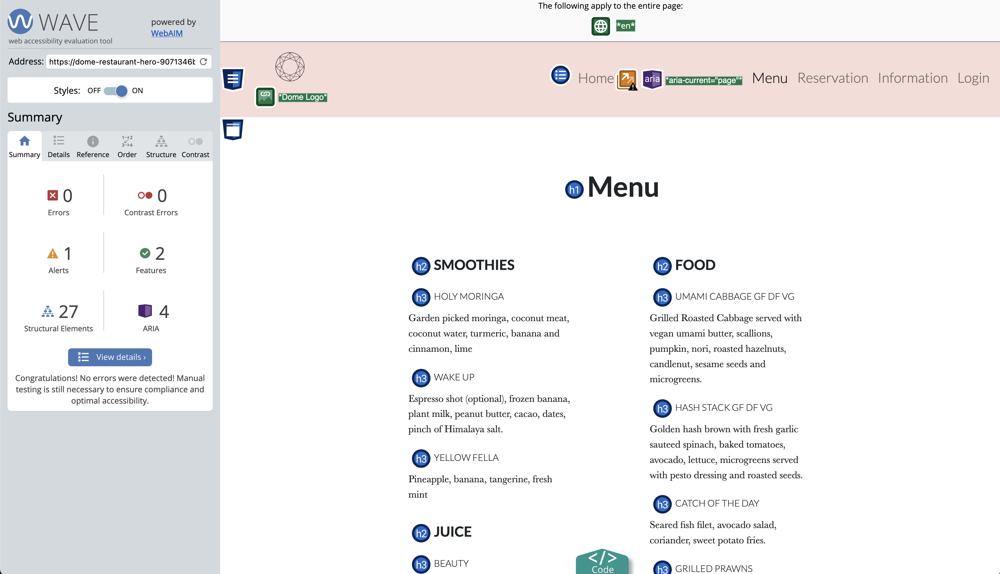  

Information Page

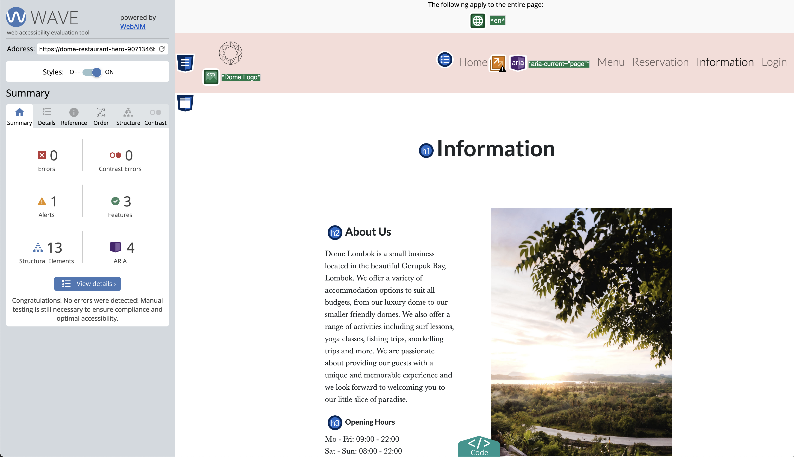  

Login Page

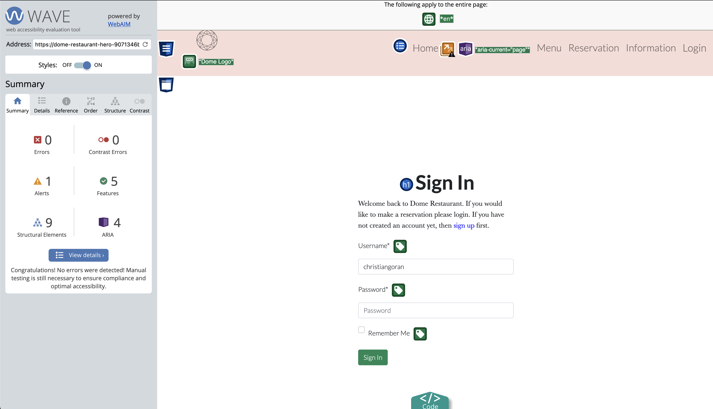  

